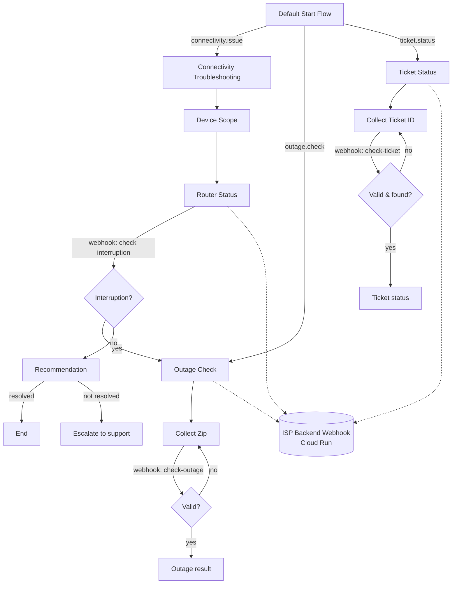

# ISP Customer Support Assistant — Dialogflow CX

A Dialogflow CX-based customer support assistant for an Internet Service
Provider, covering connectivity troubleshooting, outage checks, and ticket
status lookups, backed by a Flask webhook deployed on Google Cloud Run.

## Contents

- `app.py` — webhook entrypoint (Flask + Gunicorn)
- `services/outage_service.py` — outage lookup business logic
- `services/ticket_service.py` — ticket lookup business logic
- `Dockerfile` — container build for Cloud Run
- `requirements.txt` — Python dependencies
- `ISP_Support_Assistant_export.blob` — exported Dialogflow CX agent

## Architecture



**Why this Flow/Page structure:** each journey (Connectivity Troubleshooting,
Outage Check, Ticket Status) is its own flow, kept separate from the Default
Start Flow, which acts purely as an intent router. This mirrors how the
assignment's journeys are described — each is independently testable, and a
new journey can be added as a new flow without touching the others. Within
each flow, "Collect X" pages handle only parameter collection, while a
separate "Validate X" page handles the webhook call and outcome branching —
this keeps user-facing prompts and backend integration cleanly separated,
and made the retry-on-error logic (see below) straightforward to add without
restructuring the collection pages.

## Running the webhook locally

```bash
pip install -r requirements.txt
python app.py
```
Runs on `http://localhost:8080`. Health check: `GET /health`.

## Running the webhook on Cloud Run (as deployed)

```bash
gcloud run deploy isp-webhook \
  --source . \
  --region us-central1 \
  --allow-unauthenticated \
  --port 8080
```

No environment variables are required — the current implementation uses
in-memory mock data for outages and tickets (see "Known limitations").

**Live URL used for this submission:**
`https://isp-webhook-191502554280.us-central1.run.app/webhook`

## Configuring / importing the Dialogflow CX agent

1. Create (or select) a GCP project and enable the **Dialogflow CX API**
   (listed as "Dialogflow API" in the API Library).
2. Go to the Dialogflow CX console → **Create agent** → **Build your own** →
   **Flow** (not Playbook).
3. Instead of building from scratch, use **Import**: Manage → Export and
   Restore → Restore, and upload `ISP_Support_Assistant_export.blob`.
4. Once imported, go to **Manage → Webhooks → ISP Backend Webhook** and
   confirm/update the URL to point at your own deployed webhook if you
   redeploy it elsewhere.
5. Open the built-in **Test Agent** simulator to try the flows.

## Tests

No automated test suite is included in this submission — testing was done
manually via the Dialogflow CX simulator and `curl`/PowerShell requests
directly against the webhook, covering all scenarios listed below.

**Scenarios manually verified:**
- Connectivity troubleshooting: happy path (issue resolved) and escalation
  path (issue not resolved)
- Outage check: outage found, no outage, invalid ZIP (with retry)
- Ticket status: found, invalid format (with retry), valid format but not
  found (with retry)
- Interruption mid-troubleshooting (outage question while router status is
  being collected)
- No-match handling (2-strike escalation) and off-topic questions
- Backend failure (webhook URL temporarily broken) → graceful fallback
  message instead of a raw error

## Interruption & Resumption Approach

An outage-related interruption while the agent is mid-way through
collecting router status is detected via a webhook call (tag
`check-interruption`) that inspects the raw captured text for
outage-related keywords, rather than relying on Dialogflow CX's built-in
intent matching at that point in the conversation.

**Why not rely on intent matching directly:** the `router_status` parameter
uses entity type `@sys.any` (needed because router descriptions vary too
widely for a closed entity set). Dialogflow CX's form-filling for an actively
required `@sys.any` parameter consumes the very next utterance as the
parameter value, even when that utterance also matches a defined intent with
high NLU confidence — this is a known behavior of `@sys.any`'s catch-all
matching, confirmed via the CX simulator's diagnostic trace during testing
(intent scored 1.0 as an alternative match but was not the one triggered).
Page-level explicit intent routes did not override this either, since
parameter form-filling is evaluated ahead of route matching in this case.

**Resolution:** the webhook-based keyword check runs after the parameter is
captured, and correctly identifies the interruption regardless of how
Dialogflow classified the utterance. On detecting an interruption, the
conversation transitions to the Outage Check flow and answers the outage
question. After answering, the conversation **exits** the troubleshooting
flow with the outage answer as the final message, rather than resuming the
router status question — the assignment explicitly allows exit as a valid
outcome, and a reliable, tested resume path could not be completed with
Dialogflow CX's page-jump constraints (a flow can only be re-entered at its
Start Page, not at an arbitrary page inside it) within the assignment's
timeline. Section "Known limitations" expands on the production fix.

## Production Considerations

**What I'd monitor:**
- **Webhook latency and failures** — Cloud Run's built-in request latency
  and error-rate metrics, plus structured logs (already emitted via Python's
  `logging` module) shipped to Cloud Logging, with alerts on elevated 5xx
  rates or p95 latency.
- **No-match rate** — Dialogflow CX's built-in Analytics tab tracks this per
  intent/page; I'd alert if it spikes above a baseline, since that usually
  signals a recent training-phrase regression or a real-world phrasing gap.
- **Conversation abandonment** — sessions that end without reaching a
  terminal "resolved"/"escalated"/"answered" page; would track via a custom
  session parameter set at each successful terminal page, exported to
  BigQuery via CX's built-in export for analysis.
- **Successful task completion** — rate of sessions reaching each flow's
  success route ($session.params.lookup_success = true, resolved = true)
  versus total sessions entering that flow.
- **Escalation rate** — frequency of the "I'll need to escalate..." and
  no-match-default paths firing, as a proxy for where the bot is
  under-serving users.

**Credentials/secrets:** none are currently required since the webhook uses
mock in-memory data. If it called a real backend (ticketing system, outage
API), credentials would be stored in **Google Secret Manager** and injected
into Cloud Run as environment variables at deploy time — never committed to
source control or hardcoded.

**Sensitive customer information:** the current mock data contains no real
PII. In production, any customer-identifying data (name, address, account
number) passed through webhook parameters should be minimized to only what's
needed per request, and Dialogflow CX's parameter-level "Redact in log"
option should be enabled for any such fields so they don't appear in
Dialogflow's own conversation logs.

**Webhook authentication:** this submission's webhook is deployed with
`--allow-unauthenticated` for ease of testing. In production, I'd switch to
Cloud Run's built-in IAM authentication (removing public access) and have
Dialogflow CX call it using a service account with the `Cloud Run Invoker`
role, or alternatively validate a shared secret header on every request.

**Logging of customer data:** current logs only include non-sensitive
identifiers (ZIP codes, ticket IDs) at INFO level for debugging. In
production I'd apply the same minimization principle to logs as to storage —
avoid logging full request bodies, and rely on Dialogflow CX's own
conversation history (with redaction enabled) rather than duplicating
customer utterances in application logs.

## Known Limitations

- **Interruption resume**: as described above, an interruption exits the
  troubleshooting flow rather than resuming it at the exact point of
  interruption. A production fix would replace `@sys.any` router-status
  collection with a constrained custom entity plus a no-match/reprompt event
  handler that re-runs intent classification before falling back to raw
  text capture, allowing genuine mid-form interruption handling.
- **Mock data only**: outage and ticket lookups use in-memory mock data
  (`services/outage_service.py`, `services/ticket_service.py`) rather than a
  real backend system — swapping in a real API call is isolated to those two
  files.
- **No automated tests**: given the assignment's timeline, testing was
  manual (documented above) rather than via an automated suite (e.g.
  pytest). This would be the first addition for an actual production
  submission.
- **Cloud Run cold starts**: occasional webhook latency spikes (observed up
  to ~2s on a cold instance) since the service scales to zero when idle;
  setting a minimum instance count would eliminate this in production.
